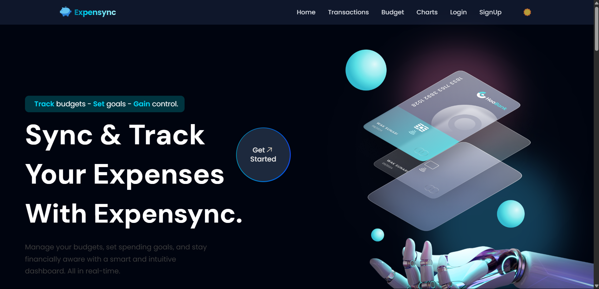
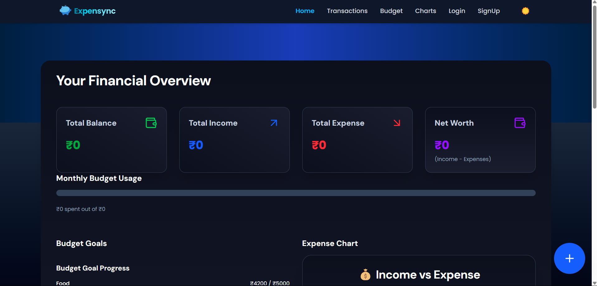

# 📊 Personal Finance Tracker+ — Personal Finance Tracker


 #### Personal Finance Tracker+ is a full-stack personal finance tracker designed to help users manage their income, expenses, and budgets in a simple yet powerful way. The platform provides a real-time overview of financial health through dashboards, interactive charts, and category-wise transaction tracking. Users can easily add, edit, and delete transactions, set budget goals, and analyze spending patterns, all from a single intuitive interface.
---

## 🚀 Features

- 🔐 **User Authentication** — Secure login and signup with JWT  
- 💰 **Track Income & Expenses** — Log and categorize your transactions  
- 🎯 **Set Budget Goals** — Define monthly limits by category  
- 📊 **Real-time Charts** — Visualize data with Pie & Doughnut graphs  
- 🧾 **Filter by Category** — Deep dive into specific spending areas  
- ⏰ **Reminders** — Add upcoming or recurring transactions  
- 📱 **Responsive Design** — Mobile-first UI with Tailwind CSS

---

## 🛠️ Tech Stack

- **MongoDB** — NoSQL database  
- **Express.js** — Backend framework  
- **React.js** — Frontend library  
- **Node.js** — Server runtime  
- **JWT** — Authentication via tokens  
- **Chart.js** — Financial data visualization  
- **Tailwind CSS** — Utility-first responsive styling  

---

## 📦 Installation Guide

### ⚙️ Prerequisites

- Node.js v16+  
- MongoDB or MongoDB Atlas  

---

### 📁 Clone Repository

```bash
git clone https://github.com/your-username/expensync.git
cd expensync
```

---

### 🔧 Backend Setup

```bash
cd backend
npm install
```

Create a `.env` file in `backend/` and add:

```env
MONGO_URI=your_mongodb_connection_string
JWT_SECRET=your_jwt_secret_key
PORT=5000
```

Start the backend server:

```bash
npm start
```

---

### 💻 Frontend Setup

```bash
cd ../frontend
npm install
npm start
```

Open in browser: [http://localhost:3000](http://localhost:3000)

---

## 📊 Live Demo

Check out the live version:  
👉 [https://expensync.com](https://expensyncj17.vercel.app/)

---

## 📸 Screenshots

### 🖥️ Dashboard Preview



### 🌞 Light Mode | 🌙 Dark Mode

| Light Mode                            | Dark Mode                             |
| ------------------------------------ | ------------------------------------- |
|          |            |


---

## 📚 Usage Instructions

- **Sign Up / Log In** to access your dashboard  
- **Add Transactions** with categories and amounts  
- **Set Monthly Goals** and track your progress  
- **Visualize with Charts** and analyze your trends  
- **Get Reminders** for important recurring expenses

---

## 📈 Analytics Overview

- 📌 **Category Charts** — See where your money goes  
- 🔄 **Income vs Expenses** — Understand your balance  
- ✅ **Budget Progress** — Stay on track with limits

---

## 🔐 Security Highlights

- 🔒 **JWT Authentication** for protected routes  
- 🔑 **Hashed Passwords** with bcrypt  
- 🚫 **Unauthorized Access Prevention**

---

## 🌟 Upcoming Features
 
- 🔁 Recurring Transactions  
- 💳 Real Time Link With Banks   
- 📉 Advanced Budget Forecasting

---

## 👨‍💻 Author

**Jitesh Bhakat**  
GitHub: [@Jitesh8260](https://github.com/Jitesh8260)  
LinkedIn: [Jitesh Kumar](https://www.linkedin.com/in/jitesh-kumar-2521b7249/)

---

## 🙏 Thank You

Thank you for checking out **Personal Finance Tracker+**!  
Hope it helps you manage money better and plan smarter 💸

If you found this useful, please ⭐ the repo and share it!

> _"Budgeting isn't about limiting yourself — it's about making room for the things that matter most."_

